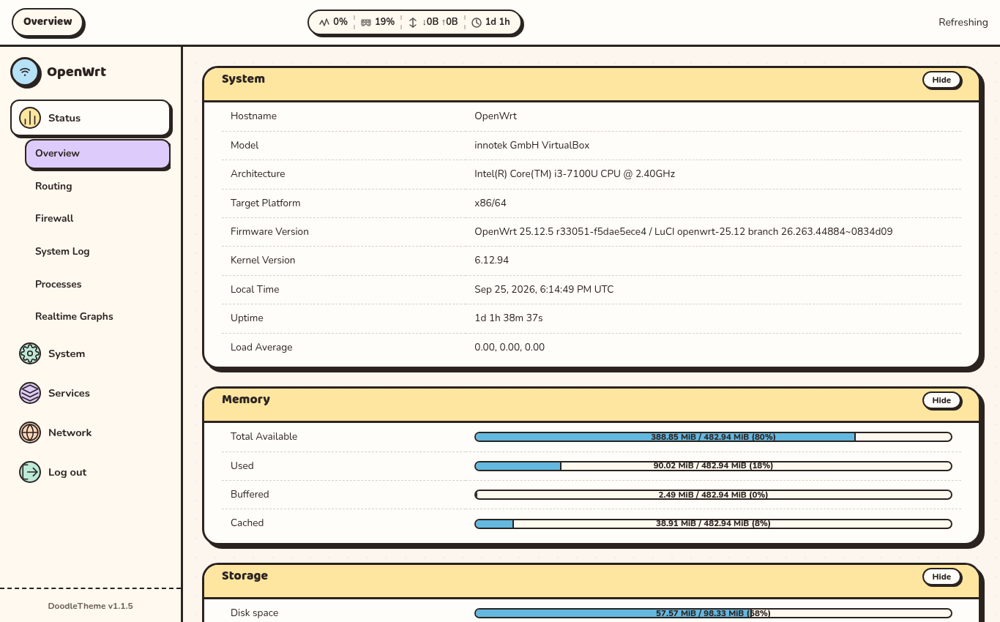
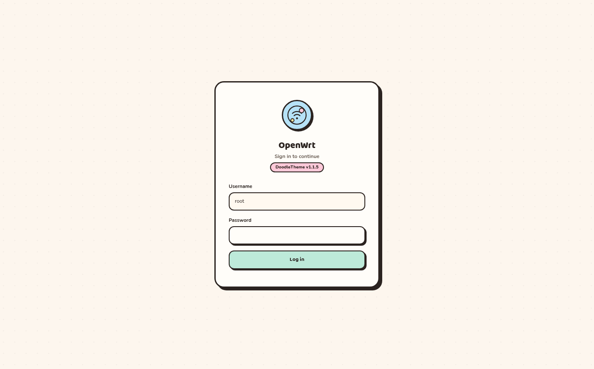

# luci-theme-doodle

A pastel doodle theme for OpenWrt LuCI — opaque paper cards, thick ink
borders, hard offset shadows.


## Screenshots

| Overview | Login |
|----------|-------|
|  |  |

## Look

- **Cards** — paper background, `3px` ink borders, hard offset shadows, `22px` radii
- **Palette** — pink, mint, sky, butter, lavender, peach, coral (each with a deep partner)
- **Type** — Baloo 2 for headings, Nunito for body, self-hosted offline (~70KB)
- **Shell** — 64px topbar with live status pill (CPU · RAM · WAN · uptime), 250px sidebar with pastel icons, slide-out drawer on mobile

## Install

Full guide with five methods in [INSTALL.md](INSTALL.md). Quickest:

```sh
# opkg (24.10 and earlier)
echo "src/gz doodle https://kobidarch.github.io/luci-theme-doodle/packages" >> /etc/opkg/customfeeds.conf
opkg update && opkg install luci-theme-doodle

# apk (25.12+)
echo "https://kobidarch.github.io/luci-theme-doodle/apk/packages.adb" >> /etc/apk/repositories.d/customfeeds.list
apk update && apk add luci-theme-doodle
```

Then pick **Doodle** under **System → System → Language and Style**.

## Configure

`/etc/config/doodle` (or **System → Doodle Theme Config** in LuCI):

| Option | Default | What it does |
|--------|---------|--------------|
| `primary` | `#ff8fac` | Accent color |
| `status_bar` | `1` | `1` shows live stats in the header, `0` hides them |
| `font_size` | `14` | Base font size in px (`13`, `14`, `16`, `18`) |
| `speed_unit` | `bits` | Throughput unit (`bits` = Mbps, `bytes` = MB/s) |

Light only. Drop a `bg.*` file into
`htdocs/luci-static/doodle/background/` for a custom backdrop.

## Develop

```sh
npm install less
lessc less/cascade.less htdocs/luci-static/doodle/css/cascade.css
lessc less/dark.less htdocs/luci-static/doodle/css/dark.css
bash build-pkg.sh   # produces dist/*.ipk (.apk needs Docker)
```

Tokens live in `less/variables.less`, mixins in `less/doodle.less`.
`dark.css` stays an empty stub (light only); compiled CSS must contain
zero `backdrop-filter`.

Bump checklist: `ucode/template/themes/doodle/version`, then the badge above.

## Compatibility

OpenWrt **23.05+**, any modern browser, no dependencies.

Layout descended from
[luci-theme-glass](https://github.com/rchen14b/luci-theme-glass) and
[luci-theme-argon](https://github.com/jerrykuku/luci-theme-argon).
Type: Baloo 2 and Nunito (OFL).

## License

[GPL-3.0](LICENSE)
